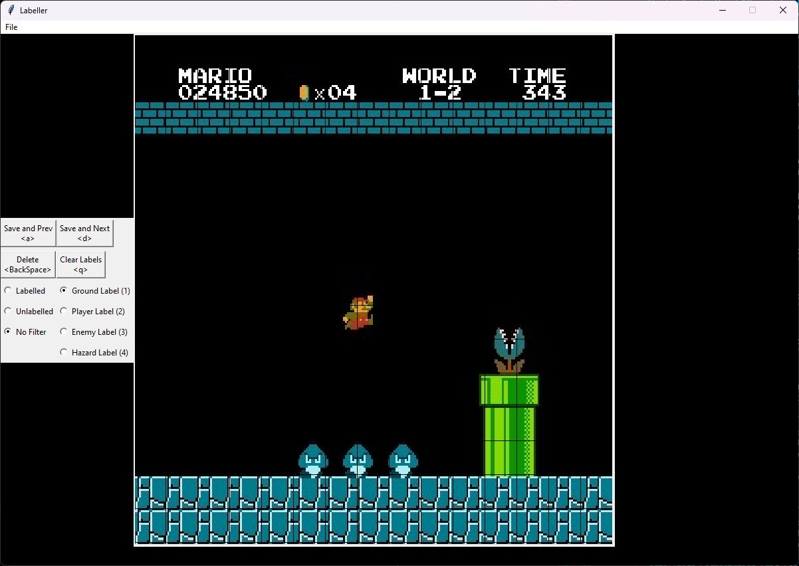
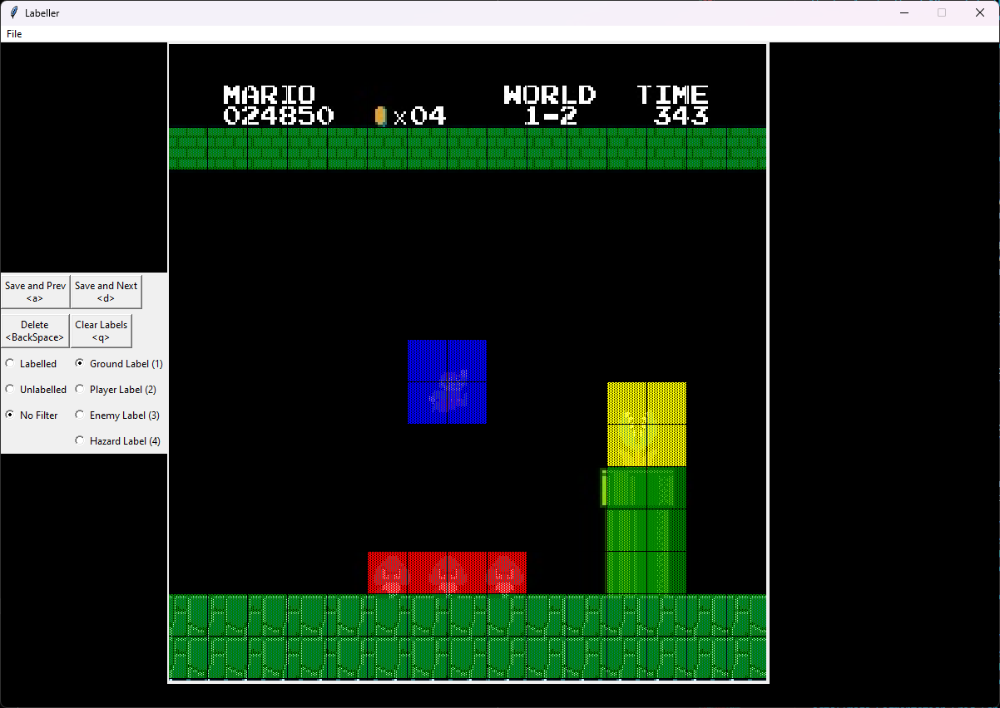

# Image_Segmentation_Grid_Labeller
This is a modified version of the manual image segmentation labelling application that I created for my Master's Research (hence the focus on NES games). It acts as an application that splits NES screenshots into 15x15 grids which can then be labelled according to the cell's contents. The images below show what this looks like. This can be used to create image segmentation datasets.

*A sample image from Super Mario Bros. that is unlabelled*

*A sample image from Super Mario Bros. that is fully labelled*